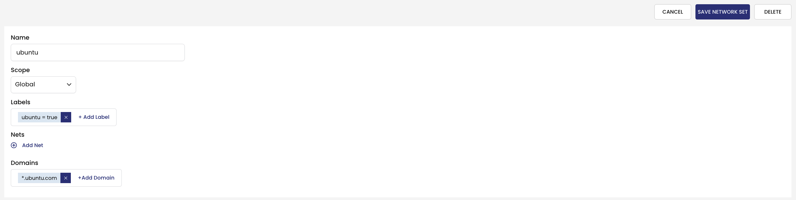
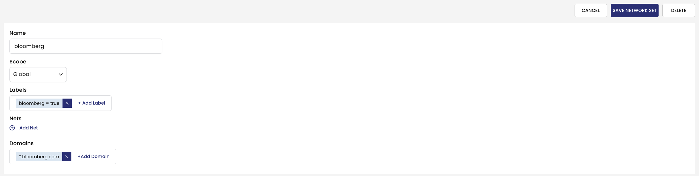

# Create Domain GlobalNetworkSets for External Services

> ### Quick Access - [Lesson Lab Tasks](#Lesson-Lab-Tasks) 

`GlobalNetworkSets` can be used to specify `allowEgressDomains` and can be referred to in security policy rules using labels. You can specify exact and wildcard domains. Refer to [GlobalNetworkSet](https://docs.tigera.io/v3.14/reference/resources/globalnetworkset) for more information. 

## `ubuntu` GlobalNetworkSet

> `ubuntu` Networkset UI View



> `ubuntu` Networkset manifest

```yaml
kubectl apply -f -<<EOF
kind: GlobalNetworkSet
apiVersion: projectcalico.org/v3
metadata:
  name: ubuntu
  labels:
    ubuntu: 'true'
spec:
  nets: []
  allowedEgressDomains:
    - '*.ubuntu.com'
EOF
```

## `bloomberg` GlobalNetworkSet

> `bloomberg` Networkset UI View



> `bloomberg` Networkset manifest

```yaml
kubectl apply -f -<<EOF
kind: GlobalNetworkSet
apiVersion: projectcalico.org/v3
metadata:
  name: bloomberg
  labels:
    bloomberg: 'true'
spec:
  nets: []
  allowedEgressDomains:
    - '*.bloomberg.com'
EOF
```

# Lesson Lab Tasks

# Lesson Video

#### <div align="right">  [Click Next -> Lesson 7 - Deploy Tiers](https://github.com/Pooriya-a/quickstart-self-service/blob/main/modules/21.deploy-tiers.md) </div>
