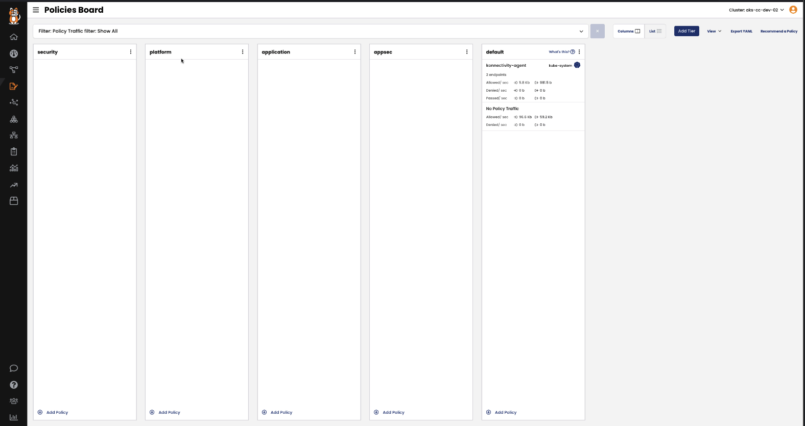
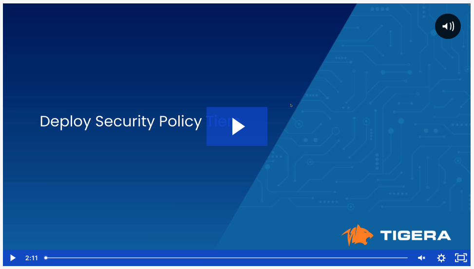

# Deploy Security Policy Tiers

Security policy tiers will be used to secure workloads in the lab cluster. The tiers will be deployed according to the security policy framework discussed in previous lesson. 

Overview of the security policy tiers:

>  01. **Security Tier** - Cluster-wide blacklist security policies and security policies needed to isolate tenant-1 and tenant-2 workloads from the rest of the cluster workloads 

```yaml
kubectl apply -f -<<EOF
apiVersion: projectcalico.org/v3
kind: Tier
metadata:
  name: security
spec:
  order: 200
EOF
```

>  02. **Platform Tier** - Security policies for platform components such as kube-dns and the ingress controller*

```yaml
kubectl apply -f -<<EOF
apiVersion: projectcalico.org/v3
kind: Tier
metadata:
  name: platform
spec:
  order: 300
EOF
```

>  03. **Application Tier** - Namespaces scoped policies for the bookinfo and yaobank application 

```yaml
kubectl apply -f -<<EOF
apiVersion: projectcalico.org/v3
kind: Tier
metadata:
  name: application
spec:
  order: 400
EOF
```

>  04. **Appsec Tier** - Granular namespace scoped policies for each deployment using policy label selectors

```yaml
kubectl apply -f -<<EOF
apiVersion: projectcalico.org/v3
kind: Tier
metadata:
  name: appsec
spec:
  order: 500
EOF
```

>  05. **Default Tier** - Default-deny security policies for tenant-01 and tenant-02 workloads


> *The Policy Board with Tiers*




# Lesson Video

[](https://tigera.wistia.com/medias/9qdjr5onoj)


#### <div align="right">  [Click Next -> Lesson 8 - Security Policies in the Default Tier](https://github.com/Pooriya-a/quickstart-self-service/blob/main/modules/22.security-policies-default-tier.md) </div>
