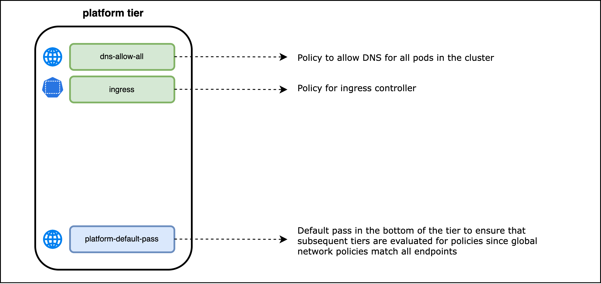
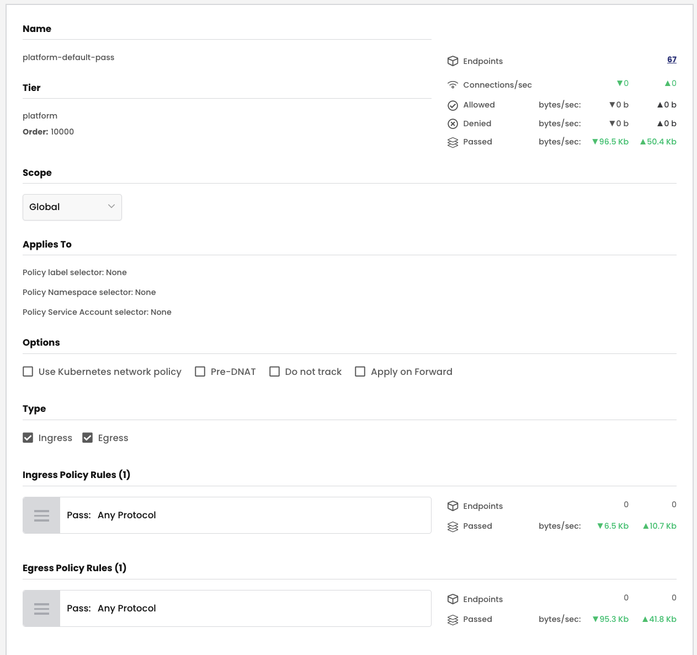
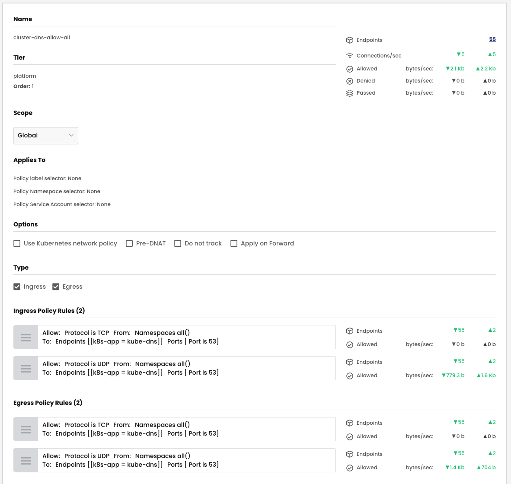
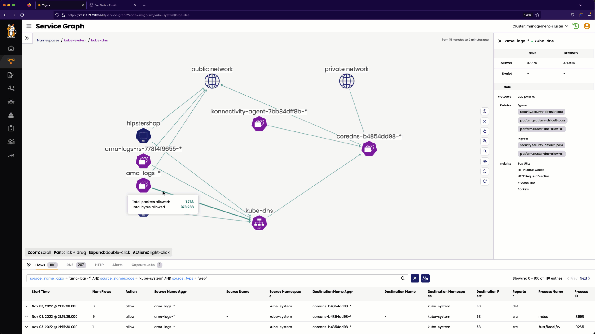
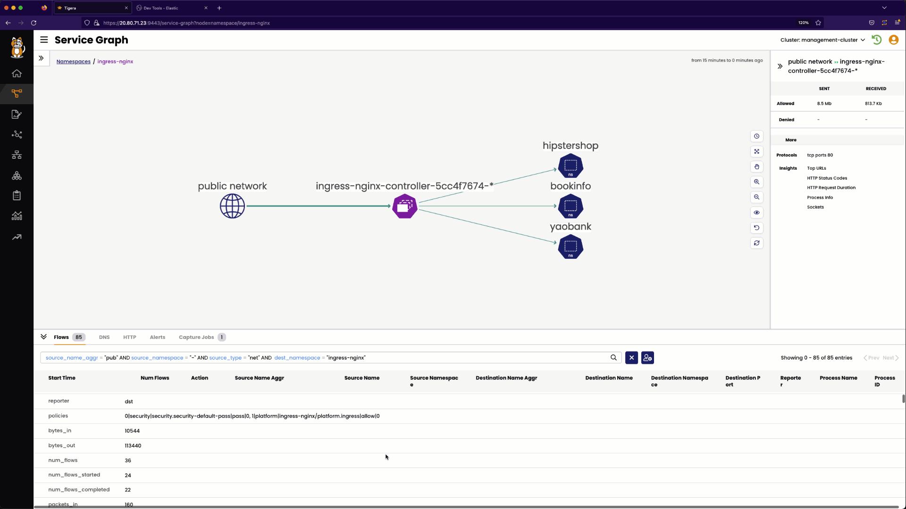
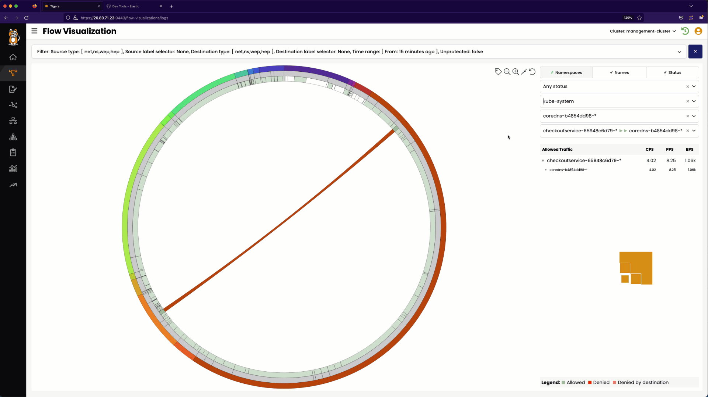

# Platform Tier Security Policies




## `platform-default-pass` Security Policy

### Policy label and Namespace Selector

There are no policy label or namespace label selectors in the `platform-default-pass` security policy. The security policy will match all cluster endpoints

### Ingress

The `platform-default-pass` security policy has the following ingress rules. 

01. **Rule 0** - For all endpoints, pass security policy evaluation to subsequent tiers for all ingress traffic. 

### Egress

The `platform-default-pass` security policy has the following egress rules. 

01. **Rule 0** - For all endpoints, pass security policy evaluation to subsequent tiers for all egress traffic. 

### Security Policy - UI View
> `platform-default-pass` security policy - UI view



### Security Policy - Manifest

> `platform-default-pass` security policy - yaml
```yaml
kubectl apply -f -<<EOF
apiVersion: projectcalico.org/v3
kind: GlobalNetworkPolicy
metadata:
  name: platform.platform-default-pass
spec:
  tier: platform
  order: 10000
  selector: ''
  namespaceSelector: ''
  serviceAccountSelector: ''
  ingress:
    - action: Pass
      source: {}
      destination: {}
  egress:
    - action: Pass
      source: {}
      destination: {}
  doNotTrack: false
  applyOnForward: false
  types:
    - Ingress
    - Egress
EOF

```

## `cluster-dns-allow-all` Security Policy

### Policy label and Namespace Selector

There are no policy label or namespace label selectors in the `cluster-dns-allow-all` security policy. The security policy will match all cluster endpoints. 

### Ingress Rules

The `cluster-dns-allow-all` security policy has the following ingress rules. **Note that `endpoint selector` labels are used in the rules to select the `kube-dns` endpoints**. 

01. **Rule 0** - `kube-dns` endpoints can receive (ingress) traffic from all endpoints in the cluster on TCP port 53. 
01. **Rule 0** - `kube-dns` endpoints can receive (ingress) traffic from all endpoints in the cluster on UDP port 53. 

### Egress Rules

The `cluster-dns-allow-all` security policy has the following egress rules. **Note that `endpoint selector` labels are used in the rules to select the `kube-dns` endpoints**. 

01. **Rule 0** - All endpoints in the cluster can send traffic to `kube-dns` endpoints on TCP port 53.
02. **Rule 1** - All endpoints in the cluster can send traffic to `kube-dns` endpoints on UDP port 53.

### Security Policy - UI View

> `cluster-dns-allow-all` security policy - UI view




### Security Policy - Manifest

> `cluster-dns-allow-all` security policy - yaml

```yaml
kubectl apply -f -<<EOF
apiVersion: projectcalico.org/v3
kind: GlobalNetworkPolicy
metadata:
  name: platform.cluster-dns-allow-all
spec:
  tier: platform
  order: 1
  selector: ''
  namespaceSelector: ''
  serviceAccountSelector: ''
  ingress:
    - action: Allow
      protocol: TCP
      source:
        namespaceSelector: all()
      destination:
        selector: k8s-app == "kube-dns"
        ports:
          - '53'
    - action: Allow
      protocol: UDP
      source:
        namespaceSelector: all()
      destination:
        selector: k8s-app == "kube-dns"
        ports:
          - '53'
  egress:
    - action: Allow
      protocol: TCP
      source:
        namespaceSelector: all()
      destination:
        selector: k8s-app == "kube-dns"
        ports:
          - '53'
    - action: Allow
      protocol: UDP
      source:
        namespaceSelector: all()
      destination:
        selector: k8s-app == "kube-dns"
        ports:
          - '53'
  doNotTrack: false
  applyOnForward: false
  types:
    - Ingress
    - Egress
EOF

```

### Validate Service Graph Security Policy Evaluation



### Validate Flow Visualization Security Policy Evaluation


## `ingress` Security Policy

### Security Policy - UI View


### Security Policy - Manifest

```yaml
kubectl apply -f -<<EOF
apiVersion: projectcalico.org/v3
kind: NetworkPolicy
metadata:
  name: platform.ingress
  namespace: ingress-nginx
spec:
  tier: platform
  order: 2
  selector: app.kubernetes.io/name == "ingress-nginx"
  serviceAccountSelector: ''
  ingress:
    - action: Allow
      protocol: TCP
      source: {}
      destination:
        ports:
          - '80'
          - '443'
    - action: Allow
      source:
        namespaceSelector: projectcalico.org/name == "kube-system"
      destination: {}
  egress:
    - action: Allow
      source: {}
      destination:
        namespaceSelector: >-
          projectcalico.org/name == "hipstershop" || projectcalico.org/name ==
          "yaobank" || projectcalico.org/namespace == "bookinfo"
    - action: Allow
      source: {}
      destination:
        selector: endpoints.projectcalico.org/serviceName == "kubernetes"
        namespaceSelector: projectcalico.org/name == "default"
  types:
    - Ingress
    - Egress
EOF

```

### Validate Service Graph Security Policy Evaluation



### Validate Flow Visualization Security Policy Evaluation



#### <div align="right">  [Click Next -> Lesson 11 - Security Policies in the Application Tier](https://github.com/Pooriya-a/quickstart-self-service/blob/main/modules/25.security-policies-in-application-tier.md) </div>
