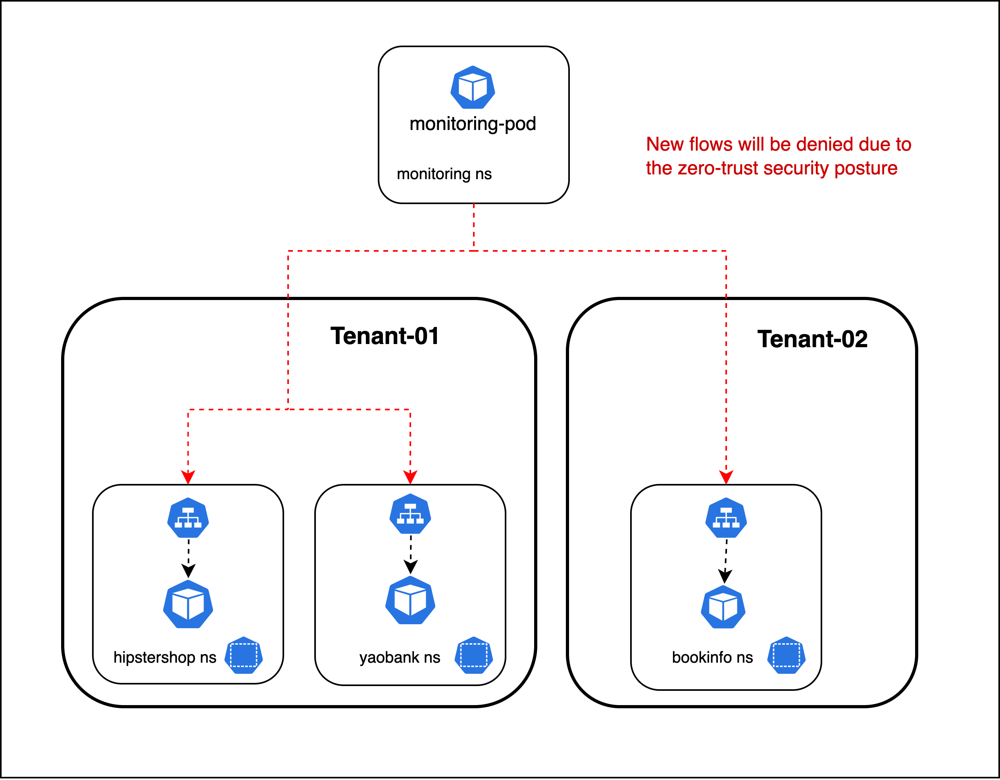
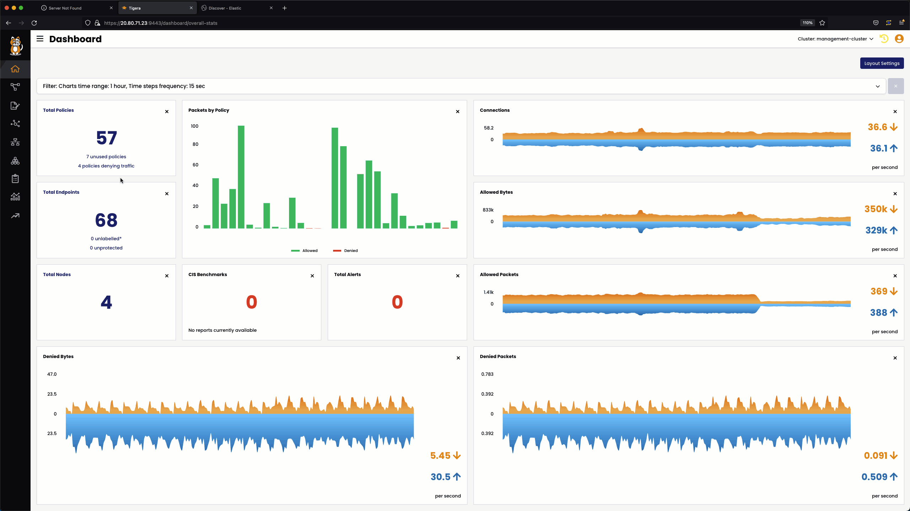

# Introduce New Flows

In this lesson new flows will be introduced to the cluster. The objective is to observe which security policies will deny these flows and understand how the flows can be allowed in subsequent lessons.

## Deploy `monitoring-pod`

A `monitoring-pod` deployed in the `monitoring` namespace will be used to target the the `productpage`, `frontend`, and  `customer` microservices of the `bookinfo`, `hipstershop`, and `yaobank` namespaces respectively. 

> The `monitoring-pod` 



Follow the below steps to deploy the `monitoring-pod` and iniate `curl` to the `productpage`, `frontend`, and  `customer` microservices.

```bash
kubectl create ns monitoring
kubectl run monitoring-pod --namespace monitoring -i --tty --image nicolaka/netshoot -- /bin/bash

while sleep 1;
do 
curl http://frontend.hipstershop.svc.cluster.local 
curl http://customer.yaobank.svc.cluster.local 
curl http://productpage.bookinfo.svc.cluster.local:9080
done
```

### `monitoring` to `hipstershop`

Observe the `Policies Board` to identify the security policy that will deny traffic from the `monitoring` namespace to the `hipstershop` namespace. 


### `monitoring` to `yaobank`

Observe the `Policies Board` to identify the security policy that will deny traffic from the `monitoring` namespace to the `yaobank` namespace. 


### `monitoring` to `bookinfo`

Observe the `Policies Board` to identify the security policy that will deny traffic from the `monitoring` namespace to the `bookinfo` namespace. 


# Deploy `loadgeneratorv2`

The `loadgeneratorv2` deployment is similar to the `loadgenerator` deployment and will generate request to the `frontend` service. However, the deployment uses a different label and is not selected by the `loadgenerator` security policy in the `hipstershop` namespace. 


## `loadgeneratorv2` to `frontend` in the `hipstershop` namespace

Observe the `Policies Board` to identify the security policy that will deny traffic from the `loadgeneratorv2` deployment to the `frontend` service in the `hipstershop` namespace. 


# Initiate Traffic from `ratings` in the `bookfinfo` namespace to `www.github.com`

`exec` into the `ratings` pod and initiate traffic from the pod to `www.github.com`


## `ratings` to `www.github.com`

Observe the `Policies Board` to identify the security policy that will deny traffic from the `ratings` deployment in the `bookinfo` namespace to `www.github.com`


## Filter Security Policies Denying Flows

Click on `poliicies denying traffic` in the dashboard to filter the security policies denying the new flows introduced in this lesson. 



#### <div align="right">  [Click Next -> Lesson 16 - Using Service Graph to Identify Denied Flows](https://github.com/tigera-cs/quickstart-self-service/blob/main/modules/sg-denied-flow.md) </div>
