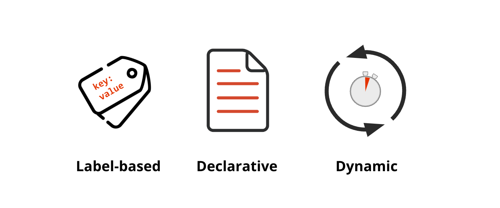

# Module 2 - Introduction

## Security Policy Characteristics

Calico security policies are:
- Declarative - Offers a powerful policy language to define security intentions
- Label-based - Maps security policies to endpoints based on workload identity 
- Dynamic - Security policies are tightly coupled with workloads

> Security Policy Characteristics

#### 
  [Next: Lesson 1 - The Anatomy of a Security Policy](https://github.com/Pooriya-a/quickstart-self-service/blob/main/modules/7.policies-rules.md) 

