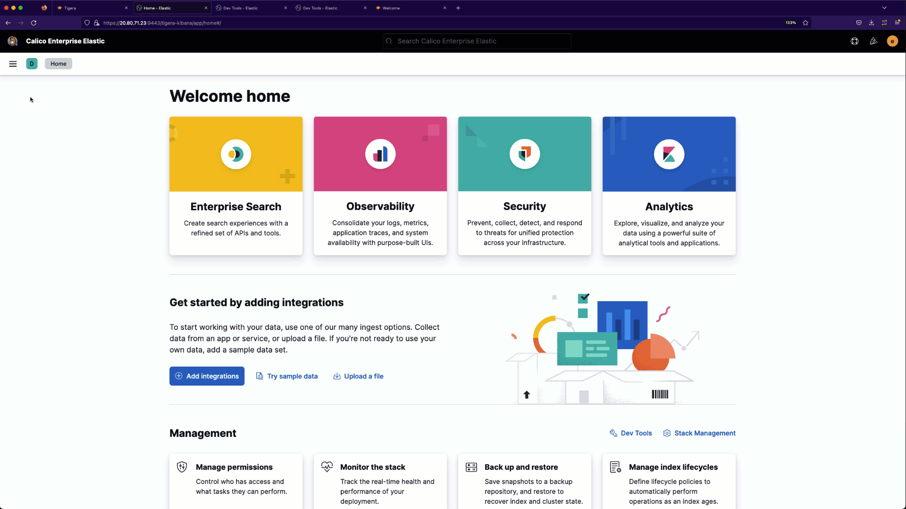

# Analyze Traffic to External Services using Service Graph and Kibana

Kubernetes workloads may communicate with external services external to the cluster. Outbound access should be protected using security policies. Calico `DNS Policy` can grant access to external services using domain names. Refer [DNS Policy](https://docs.tigera.io/v3.14/security/domain-based-policy) for more information on domain matching. 

The Service Graph and Kibana can be used to retrieve a list of domains for individual workloads. Domain names can be added to a `GlobalNetworkSet` and referred to in security policies to grant access to external services. 

## Analyze Traffic to External Services using the Service Graph

The Service Graph will represent connectivity to external services using the 'Public network' or 'Private network' icons depending on whether the workload connected to a public or private IP. The name of the `NetworkSet` or `GlobalNetworkSet` will be depicted in the Service Graph if configured for the respective domains. 

> Public services in the Service Graph

## Analyze Traffic to External Services using Kibana

Kibana can be used to generated a summarized list of FQDNs for a given workload or group of workloads. The list of FQDNs can be incorporated into a `GlobalNetworkSet`

Use the `Top 10 External Domains` visualization to identify the external services the `hipstershop`, `yaobank` and `bookinfo` namespaces communicate to. 

> Kibana DNS external domains

#### 
  [Next: Lesson 6 - Create Domain Networksets for External Services](https://github.com/tigera-cs/quickstart-self-service/blob/main/modules/analyze-networksets-external-services.md) 

