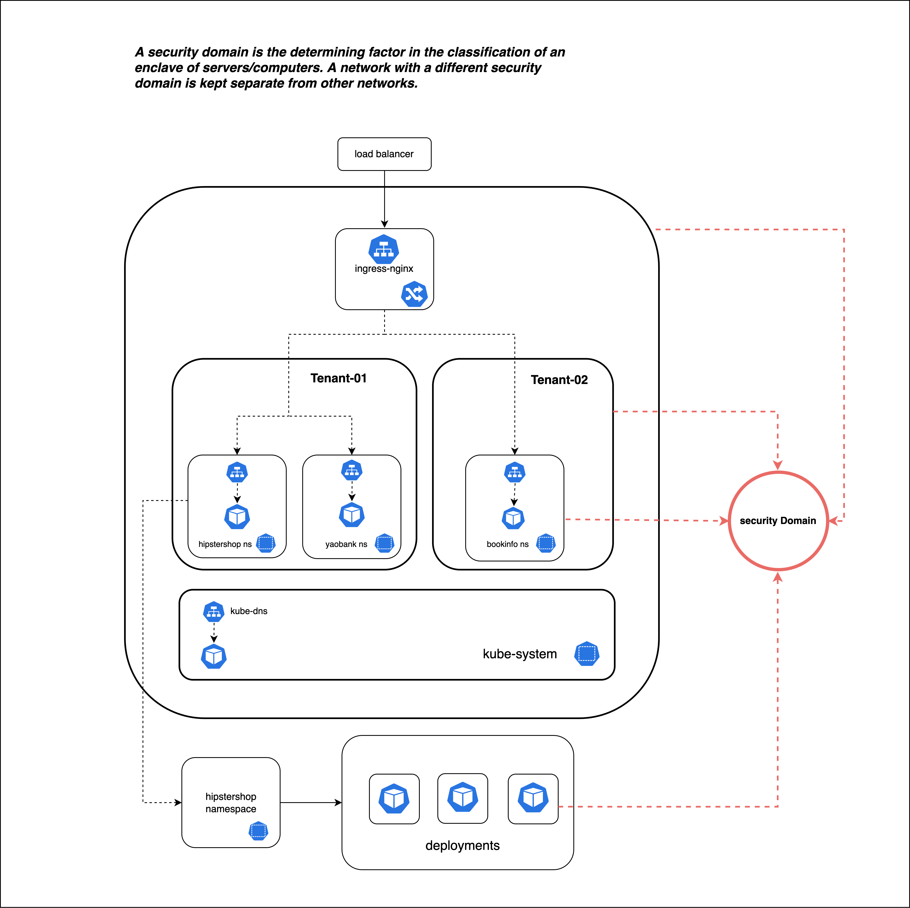

# Module 3 - Introduction

## Security Domains

A security policy framework to secure tenants and applications will be explored in this module. Calico offeres a powerful policy-model that can be used to implement a hierarchical approach to security. Unlike traditional firewalls which implement security as traffic transits certain points in the network, Calico enforces security for each endpoint or workload in the cluster. It is important to understand the concept `security domains` prior to implementing hierarchical controls for Kubernetes workloads. Once the securty domains are identified, Calico's `tiers` and `security policy` constructs will be used to define a security policy framework. 

The following can be considered `security domains` for which security policies must be enforced.

1.  **The cluster** - The cluster can be considered a single `security domain`. For example, a `threatfeed` security policy that would `deny` egress connectivity to malicious IPs can be enforced for all cluster workloads. 

2.  **Tenants** - Tenants are separate `security domains`. For example, tenant-1 and tenant-2 workloads must be isolated from the rest of the cluster workloads. Although the concept of tenants is used in the workshop, it can be extended to environments such as PCI or business units in an organization. It is simply, a collection of applications or namespaces for which a security definition must be enforced.  

3.  **Namespaces** - Namespaces are a logical Kubernetes construct and can be used to organize Kubernetes resources such as deployments and services. A namespace would typicall consist of a collection of microservices that make up an application. Namespaces can also be considered separate `security domains`. For example, applications must be protected from other applications within the same tenant.

4.  **Deployments** - Deployments are a Kubernetes construct that comprises of workloads or pods that make up a microservices. Microservices must be protected from other microservices to limit the blast radius if a microservice were to get compromised. For example, a `frontend` microservices and a `backend` microservice can be in the same namespace but can still be considered separate `security domains` as the function and criticality of the microservices differ and must be protected by separate security policies.   

> Security domains

> #### 
  [Next: Lesson 1 - Security Policy Framework Overview](https://github.com/tigera-cs/quickstart-self-service/blob/main/modules/security-policy-framework-overview.md) 

