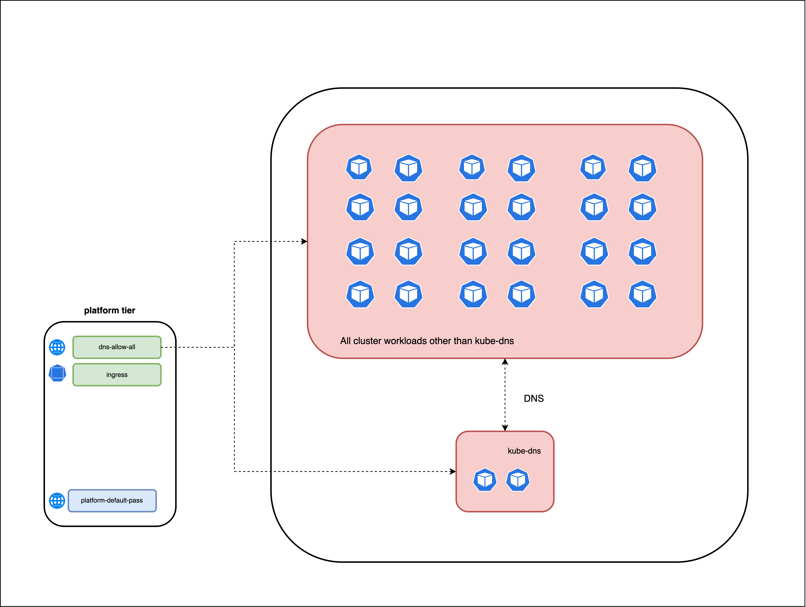

# The Platform Tier

## `cluster-dns-allow-all` Security Policy

The `dns-allow-all` security policy will have rules to permit ingress DNS traffic to the kube-dns endpoints on TCP and UDP port 53 from all endpoints in the cluster. The security policy will also have egress rules to permit all endpoints in the cluster to send DNS traffic to the kube-dns endpoints on the same ports. The security poilcy will be a [globalnetworkpolicy](https://docs.tigera.io/reference/resources/globalnetworkpolicy) that applies to all cluster workloads/pods; however, policy rules will have endpoint selectors to match the kube-dns endpoints. 

> cluster-dns-allow-all

## `ingress` Security Policy

The `ingress` security policy will have rules to permit inbound traffic to the ingress controller from public and private networks on TCP port 80 and 443. The security policy will also have egress rules permitting traffic to namespaces that host externally accessible services which are exposed as ingress resources. 

## `platform-default-pass` Security Policy

The `platform-default-pass` security policy will have the lowest precedence in the platform tier. It is deployed to ensure that a `pass` action is applied to all endpoints matched in the tier and for flows that were not denied in a previous tier. It is required since the `cluster-dns-allow-all` security policy matched all cluster workloads. Note that if a workload is matched by a security policy in a tier, any traffic flow that **does not** match an `allow` rule for that workload either in that security policy or a subsequent security policy that matches the workloads in the **same tier**, will have an implicit `deny` behavior. This can be circumvented by deploying a security policy that matches the workload and has `pass` rules for all ingress and egress traffic flows. The `platform-default-pass` security policy will be a [globalnetworkpolicy](https://docs.tigera.io/reference/resources/globalnetworkpolicy) that applies to all cluster workloads/pods. 

> platform-default-pass security policy

