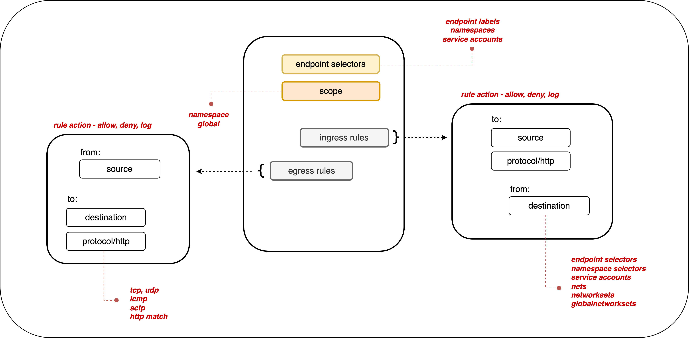

# The Anatomy of a Security Policy

## `kind`

There are two types of security policies
- `NetworkPolicy` 
- `Globalnetworkpolicy`

## `scope`

- A `NetworkPolicy` has a scope that applies to the namespace specified in the policy. Refer [NetworkPolicy](https://docs.tigera.io/reference/resources/networkpolicy) for more information. 
- A `GlobalNetworkPolicy` has a scope that applies to either all namespaces or namespaces specified using the `namespaceSelector` in the security policy. Refer [GlobalNetworkPolicy](https://docs.tigera.io/reference/resources/globalnetworkpolicy) for more information. 

## `selectors`

The following selectors are available:

- `namespaceSelector` - Selects the namespace(s) to which a [GlobalNetworkPolicy](https://docs.tigera.io/reference/resources/globalnetworkpolicy) applies. Select a specific namespace by name using the 'projectcalico.org/name' label. Note that the selector is only available for [GlobalNetworkPolicy](https://docs.tigera.io/reference/resources/globalnetworkpolicy).

- `serviceAccountSelector` - Selects the service account(s) to which a security policy applied. Select all service accounts in the cluster with a specific name using the `projectcalico.org/name` label. Available in both [NetworkPolicy](https://docs.tigera.io/reference/resources/globalnetworkpolicy) and [GlobalNetworkPolicy](https://docs.tigera.io/reference/resources/globalnetworkpolicy).

- `selector` - 	Selects the endpoints to which a policy applied. A selector is an expression which can be used to either match or unmatch resources based on their labels. Calico Enterprise label selectors support a number of operators, which can be combined into larger expressions using the boolean operators and parentheses. For more information refer: [selector](https://docs.tigera.io/reference/resources/globalnetworkpolicy#selector). 

## `ingress rules`

One or more `ingress` rules to allow traffic to the **selected** endpoints. The `source` field in the rule can be used to select the endpoints from which traffic must be allowed. The `destination` field can be used to select a subset of destinations from the endpoints selected/matched by the policy. 

## `egress rules`

One or more `egress` rules to allow traffic from the **selected** endpoints. The `source` field in the rule can be used to select a subset of endpoints from the endpoints selected/matched by the policy. The `destination` field can be used to select the endpoints to which traffic must be allowed. 

> The Anatomy of a Security Policy

