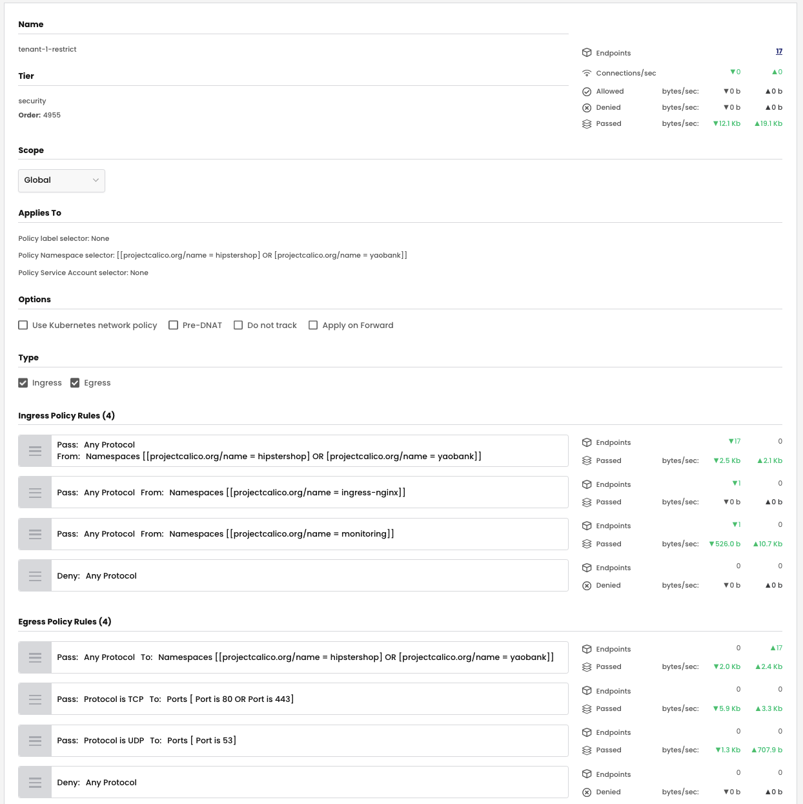
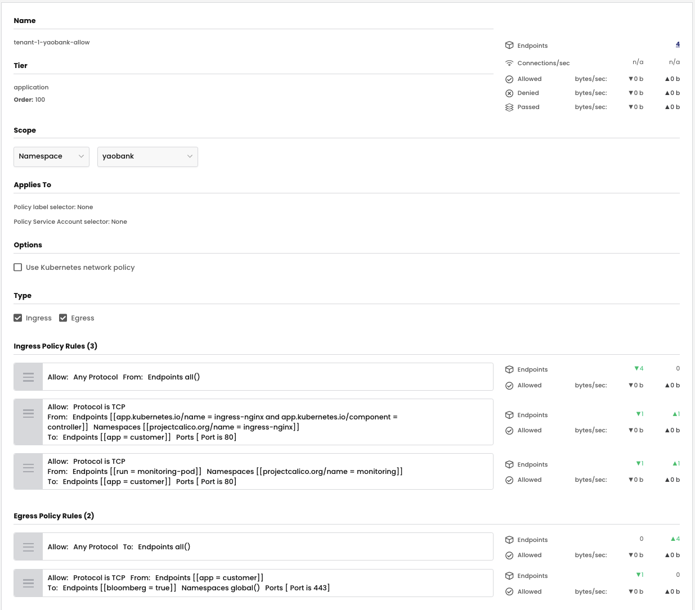
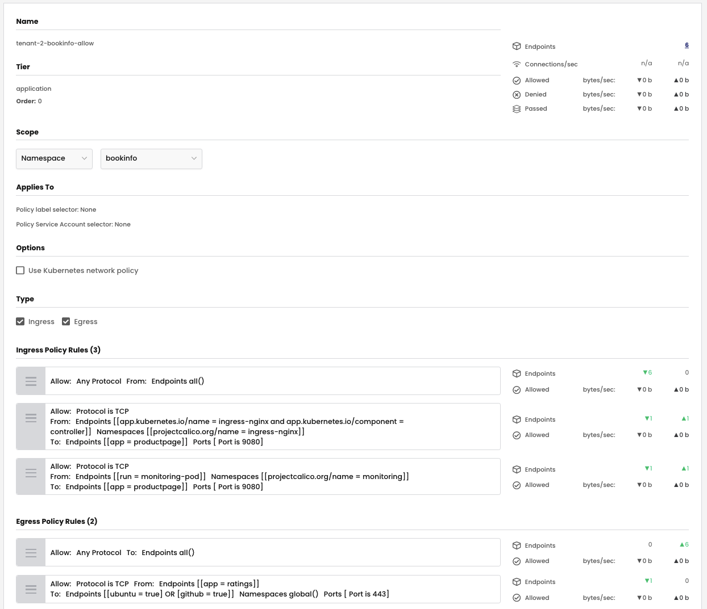

# Remediate Security Policies to Permit Denied Flows

The changes made to the security policies to allow the new flows are highlighted below. 

## `tenant-1-restrict` Security Policy

### Ingress Rules

The below ingress rule was added to the `tenant-1-restrict` security policy

- **Rule 2** For endpoints in tenant-1, pass security policy evaluation to subsequent tiers if traffic is **from** any endpoint in the `monitoring` namespace. 

### Security Policy - UI View

> `tenant-1-restrict` security policy - UI view



### Security Policy - Manifest

> `tenant-1-restrict` security policy - yaml

```yaml
apiVersion: projectcalico.org/v3
kind: GlobalNetworkPolicy
metadata:
  name: security.tenant-1-restrict
spec:
  tier: security
  order: 2
  selector: ''
  namespaceSelector: >-
    projectcalico.org/name == "hipstershop" || projectcalico.org/name ==
    "yaobank"
  serviceAccountSelector: ''
  ingress:
    - action: Pass
      source:
        namespaceSelector: >-
          projectcalico.org/name == "hipstershop" || projectcalico.org/name ==
          "yaobank"
      destination: {}
    - action: Pass
      source:
        namespaceSelector: projectcalico.org/name == "ingress-nginx"
      destination: {}
    - action: Pass
      source:
        namespaceSelector: projectcalico.org/name == "monitoring"
      destination: {}
    - action: Deny
      source: {}
      destination: {}
  egress:
    - action: Pass
      source: {}
      destination:
        namespaceSelector: >-
          projectcalico.org/name == "hipstershop" || projectcalico.org/name ==
          "yaobank"
    - action: Pass
      protocol: TCP
      source: {}
      destination:
        ports:
          - '80'
          - '443'
    - action: Pass
      protocol: UDP
      source: {}
      destination:
        ports:
          - '53'
    - action: Deny
      source: {}
      destination: {}
  doNotTrack: false
  applyOnForward: false
  preDNAT: false
  types:
    - Ingress
    - Egress
```
## `tenant-2-restrict` Security Policy

### Ingress Rules

The below ingress rule was added to the `tenant-2-restrict` security policy

- **Rule 2** For endpoints in tenant-2, pass security policy evaluation to subsequent tiers if traffic is **from** any endpoint in the `monitoring` namespace. 

### Security Policy - UI View

> `tenant-2-restrict` security policy - UI view


### Security Policy - Manifest

> `tenant-2-restrict` security policy - yaml

```yaml
apiVersion: projectcalico.org/v3
kind: GlobalNetworkPolicy
metadata:
  name: security.tenant-2-restrict
spec:
  tier: security
  order: 3
  selector: ''
  namespaceSelector: projectcalico.org/name == "bookinfo"
  serviceAccountSelector: ''
  ingress:
    - action: Pass
      source:
        namespaceSelector: projectcalico.org/name == "bookinfo"
      destination: {}
    - action: Pass
      source:
        namespaceSelector: projectcalico.org/name == "ingress-nginx"
      destination: {}
    - action: Pass
      source:
        namespaceSelector: projectcalico.org/name == "monitoring"
      destination: {}
    - action: Deny
      source: {}
      destination: {}
  egress:
    - action: Pass
      source: {}
      destination:
        namespaceSelector: projectcalico.org/name == "bookinfo"
    - action: Pass
      protocol: UDP
      source: {}
      destination:
        ports:
          - '53'
    - action: Pass
      protocol: TCP
      source: {}
      destination:
        ports:
          - '443'
    - action: Deny
      source: {}
      destination: {}
  doNotTrack: false
  applyOnForward: false
  preDNAT: false
  types:
    - Ingress
    - Egress
```
## `tenant-01-yaobank-allow` Security Policy

### Ingress Rules

The below ingress rule was added to the `tenant-1-yaobank-allow` security policy

- **Rule 2** For the `customer` endpoints, allow ingress traffic from the `monitoring-pod` endpoints on TCP port 80. The ` projectcalico.org/name == monitoring` namespace selector is used to specify the source namespace and the `run == "monitoring-pod` endpoint selector is used to specify the source workload.  

### Security Policy - UI View

> `tenant-1-yaobank-allow` security policy - UI view



### Security Policy - Manifest

> `tenant-1-yaobank-allow` security policy - yaml

```yaml
apiVersion: projectcalico.org/v3
kind: NetworkPolicy
metadata:
  name: application.tenant-1-yaobank-allow
  namespace: yaobank
spec:
  tier: application
  order: 100
  selector: ''
  serviceAccountSelector: ''
  ingress:
    - action: Allow
      source:
        selector: all()
      destination: {}
    - action: Allow
      protocol: TCP
      source:
        selector: >-
          (app.kubernetes.io/name == "ingress-nginx" &&
          app.kubernetes.io/component == "controller")
        namespaceSelector: projectcalico.org/name == "ingress-nginx"
      destination:
        selector: app == "customer"
        ports:
          - '80'
    - action: Allow
      protocol: TCP
      source:
        selector: run == "monitoring-pod"
        namespaceSelector: projectcalico.org/name == "monitoring"
      destination:
        selector: app == "customer"
        ports:
          - '80'
  egress:
    - action: Allow
      source: {}
      destination:
        selector: all()
    - action: Allow
      protocol: TCP
      source:
        selector: app == "customer"
      destination:
        selector: bloomberg == "true"
        namespaceSelector: global()
        ports:
          - '443'
  types:
    - Ingress
    - Egress
```


## `tenant-02-bookinfo-allow` Security Policy

### Ingress Rules

The below ingress rule was added to the `tenant-2-restrict` security policy

- **Rule 2** For the `productpage` endpoints, allow ingress traffic from the `monitoring-pod` endpoints on TCP port 9080. The ` projectcalico.org/name == monitoring` namespace selector is used to specify the source namespace and the `run == "monitoring-pod` endpoint selector is used to specify the source workload.  

### Security Policy - UI View

> `tenant-2-bookinfo-allow` security policy - UI view



### Security Policy - Manifest

> `tenant-2-bookinfo-allow` security policy - yaml

```yaml
apiVersion: projectcalico.org/v3
kind: NetworkPolicy
metadata:
  name: application.tenant-2-bookinfo-allow
  namespace: bookinfo
spec:
  tier: application
  order: 0
  selector: ''
  serviceAccountSelector: ''
  ingress:
    - action: Allow
      source:
        selector: all()
      destination: {}
    - action: Allow
      protocol: TCP
      source:
        selector: >-
          (app.kubernetes.io/name == "ingress-nginx" &&
          app.kubernetes.io/component == "controller")
        namespaceSelector: projectcalico.org/name == "ingress-nginx"
      destination:
        selector: app == "productpage"
        ports:
          - '9080'
    - action: Allow
      protocol: TCP
      source:
        selector: run == "monitoring-pod"
        namespaceSelector: projectcalico.org/name == "monitoring"
      destination:
        selector: app == "productpage"
        ports:
          - '9080'
  egress:
    - action: Allow
      source: {}
      destination:
        selector: all()
    - action: Allow
      protocol: TCP
      source:
        selector: app == "ratings"
      destination:
        selector: ubuntu == "true" || github == "true"
        namespaceSelector: global()
        ports:
          - '443'
  types:
    - Ingress
    - Egress
```

## `frontend` and `loadgenerator` Security Policies

### `frontend` Security Policy

### Ingress Rules

The below ingress rules were added/modified in the `frontend` security policy

- **Rule 2** For the `frontend` endpoints, allow ingress traffic from the `monitoring-pod` endpoints on TCP port 8080. The ` projectcalico.org/name == monitoring` namespace selector is used to specify the source namespace and the `run == "monitoring-pod` endpoint selector is used to specify the source workload.  

- **Rule 0 - modified** - For the `frontend` endpoints, allow ingress traffic from the `loadgenerator` endpoints on TCP port 8080. The `app == loadgenerator` or **`app == loadgeneratorv2`**   endpoint selector is used in the rule to specify the source workloads.

### Security Policy - UI View

> `frontend` security policy - UI view


### Security Policy - Manifest

> `frontend` security policy - yaml

```yaml
apiVersion: projectcalico.org/v3
kind: NetworkPolicy
metadata:
  name: appsec.frontend
  namespace: hipstershop
spec:
  tier: appsec
  order: 0
  selector: app == "frontend"
  serviceAccountSelector: ''
  ingress:
    - action: Allow
      protocol: TCP
      source:
        selector: app == "loadgenerator" || app == "loadgeneratorv2"
      destination:
        ports:
          - '8080'
    - action: Allow
      protocol: TCP
      source:
        selector: >-
          (app.kubernetes.io/component == "controller" && app.kubernetes.io/name
          == "ingress-nginx")
        namespaceSelector: projectcalico.org/name == "ingress-nginx"
      destination:
        ports:
          - '8080'
    - action: Allow
      protocol: TCP
      source:
        selector: run == "monitoring-pod"
        namespaceSelector: projectcalico.org/name == "monitoring"
      destination:
        ports:
          - '8080'
  egress:
    - action: Allow
      protocol: TCP
      source: {}
      destination:
        ports:
          - '80'
    - action: Allow
      protocol: TCP
      source: {}
      destination:
        selector: app == "adservice"
        ports:
          - '9555'
    - action: Allow
      protocol: TCP
      source: {}
      destination:
        selector: app == "cartservice"
        ports:
          - '7070'
    - action: Allow
      protocol: TCP
      source: {}
      destination:
        selector: app == "checkoutservice"
        ports:
          - '5050'
    - action: Allow
      protocol: TCP
      source: {}
      destination:
        selector: app == "currencyservice"
        ports:
          - '7000'
    - action: Allow
      protocol: TCP
      source: {}
      destination:
        selector: app == "productcatalogservice"
        ports:
          - '3550'
    - action: Allow
      protocol: TCP
      source: {}
      destination:
        selector: app == "recommendationservice"
        ports:
          - '8080'
    - action: Allow
      protocol: TCP
      source: {}
      destination:
        selector: app == "shippingservice"
        ports:
          - '50051'
  types:
    - Ingress
    - Egress
```

### `loadgenerator` Security Policy

### Policy label selector

The `app == loadgeneratorv2` policy label selector was added to the `loadgenerator` security policy; this ensures that the security policy is applied to both `loadgenerator` and `loadgeneratorv2` workloads. 

### Security Policy - UI View

> `loadgenerator` security policy - UI view


### Security Policy - Manifest

> `loadgenerator` security policy

```yaml
apiVersion: projectcalico.org/v3
kind: NetworkPolicy
metadata:
  name: appsec.loadgenerator
  namespace: hipstershop
spec:
  tier: appsec
  order: 900
  selector: app == "loadgenerator" || app == "loadgeneratorv2"
  serviceAccountSelector: ''
  egress:
    - action: Allow
      protocol: TCP
      source: {}
      destination:
        selector: app == "frontend"
        ports:
          - '8080'
  types:
    - Egress
```